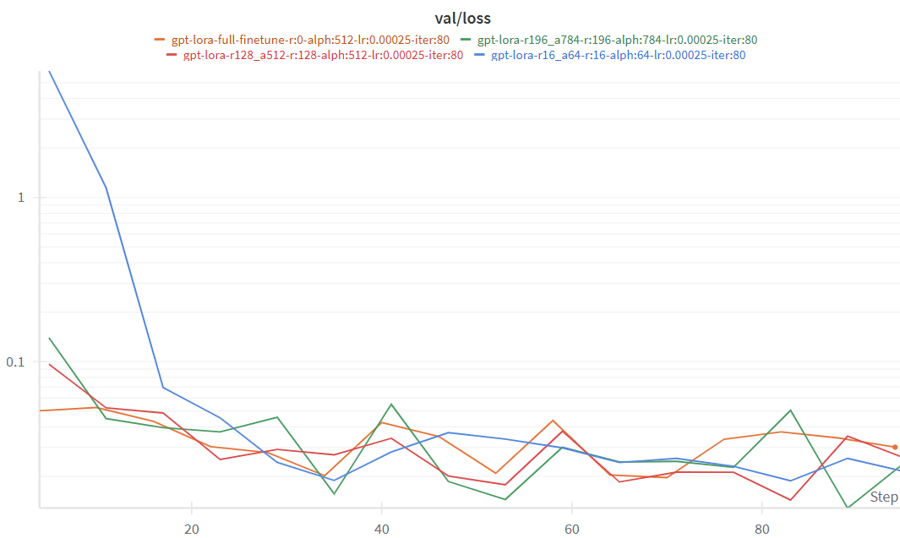

# LoRA-GPT2: Parameter-Efficient Fine-Tuning for Sentiment Analysis  

## Introduction  
Fine-tuning large pre-trained models can be computationally expensive, requiring significant memory and training time. This repository implements **Low-Rank Adaptation (LoRA)**, a **Parameter-Efficient Fine-Tuning (PEFT)** method, to efficiently fine-tune a pre-trained **GPT-2** model. Instead of updating all model parameters, LoRA introduces trainable low-rank matrices, drastically reducing computational overhead while maintaining high performance.  

## Dataset  
The model is trained on the **Rotten Tomatoes Dataset**, sourced from Hugging Face. This dataset consists of balanced movie reviews labeled as **positive** or **negative**, making it ideal for sentiment analysis. The dataset will be automatically downloaded when running `train.py`.  

## Features  
✅ Implement LoRA from scratch for efficient fine-tuning  
✅ Apply LoRA to a pre-trained GPT-2 model  
✅ Train on Rotten Tomatoes sentiment analysis dataset  
✅ Reduce memory and compute requirements compared to full fine-tuning  

Stay tuned for setup instructions, training details, and evaluation metrics! 🚀

# Test Accuracy and Observations

## Baseline Model Performance

Before fine-tuning, the test accuracy of the model is:

```plaintext
0.105
```

This low accuracy is expected since the model has not been adapted to the target task yet.

---

## LoRA Fine-Tuning Results Across Different Ranks

We investigate the effect of different LoRA ranks $r$ on test accuracy while maintaining a constant scaling factor of $\alpha = 4r$. We also compare LoRA fine-tuning to full fine-tuning (without LoRA).

| Method                                | $r$ | $\alpha$ | Test Accuracy (Best Val Checkpoint) |
|---------------------------------------|-------|------------|---------------------------------------|
| LoRA                                  | 16    | 64         | 0.8424                                |
| LoRA                                  | 128   | 512        | 0.8696                                |
| LoRA                                  | 196   | 784        | 0.8574                                |
| Full Fine-Tuning (dropout=0.05)       | 0     | --         | 0.8405                                |

### Observations:
- Increasing $r$ from 16 to 128 improves accuracy significantly, suggesting that higher-rank decompositions allow LoRA to better approximate full-rank updates.
- However, increasing $r$ further to 196 leads to a slight drop in accuracy, indicating diminishing returns or potential overfitting.
- LoRA fine-tuning can achieve comparable or even better performance than full fine-tuning while being more parameter-efficient.

---

## Convergence Analysis: Validation Loss Curves

We plot the validation loss curves for different settings of $r$ and compare them with full fine-tuning.

**Key Insights:**
- LoRA fine-tuning typically converges faster than full fine-tuning, as fewer parameters are updated, reducing the risk of overfitting.
- The validation loss curve for $r=196$ exhibits unexpected behavior, possibly due to overfitting.
- Increasing $r$ beyond 128 does not consistently improve accuracy, suggesting the need to balance expressiveness and stability.



---

## Exploring Scaling Factor $\alpha$ with Fixed $r$

Next, we analyze the impact of increasing $\alpha$ while keeping $r$ fixed at 16.

| Method                                | $r$ | $\alpha$ | Test Accuracy (Last Iter Checkpoint) |
|---------------------------------------|-------|------------|----------------------------------------|
| LoRA                                  | 16    | 64         | 0.8574                                 |
| LoRA                                  | 16    | 256        | 0.8771                                 |
| Full Fine-Tuning (dropout=0.05)       | 0     | --         | 0.8564                                 |

### Observations:
- Increasing $\alpha$ from 64 to 256 leads to an improvement in test accuracy.
- A higher $\alpha$ strengthens the influence of LoRA updates, allowing for better adaptation.
- However, excessively high $\alpha$ might introduce overfitting, so careful tuning is necessary.

---

## Relationship Between Learning Rate and Scaling Factor

Since LoRA only updates a subset of parameters ($A, B$), $\alpha$ effectively acts as a learning rate multiplier. This means that adjusting both the learning rate and $\alpha$ simultaneously can be redundant.

- Increasing either $\alpha$ or the learning rate amplifies LoRA’s weight updates.
- Instead of changing both, it is more effective to fix one and tune the other.

---

## Effect of Prompt Modifications on Performance

To investigate how changes in the prompt influence model performance, we modified the instruction in `get_sentiment_prompt()`.

| Idea Type   | Prompt | Test Accuracy [Last Iter] | Test Accuracy [Best Val] |
|-------------|--------|---------------------------|--------------------------|
| **default** | Please read the following text and classify it as either positive or negative sentiment. Remember to consider the overall tone, context, and emotional cues conveyed in the text. Positive sentiments generally express happiness, satisfaction, or positivity, while negative sentiments convey sadness, anger, or negativity. | 0.8808 | 0.8696 |
| **simple 1** | Classify the following text as either positive or negative sentiment. | 0.4446 | 0.7270 |
| **simple 2** | Read the text below and classify its sentiment as either positive or negative. Positive means happiness or satisfaction, while negative means sadness or anger. | 0.8780 | 0.8170 |
| **similar**  | Classify the sentiment of the following text as either positive or negative. A positive sentiment conveys happiness, satisfaction, or optimism, while a negative sentiment reflects sadness, frustration, or dissatisfaction. Focus on the overall tone and context. | 0.8433 | 0.8149 |
| **complex**  | Analyze the following text and determine whether its sentiment is positive or negative. Consider the emotional intent, tone, and wording used. Positive sentiment includes expressions of joy, gratitude, enthusiasm, or appreciation, while negative sentiment includes frustration, disappointment, criticism, or sadness. Provide the most accurate classification based on these cues. | **0.8836** | **0.8742** |

### Observations:
- Simpler prompts (e.g., “Classify the following text”) led to significantly lower accuracy, likely due to a lack of context.
- More detailed prompts helped guide the model toward better predictions.
- The best performance was achieved with a complex but well-structured prompt.

---

## Conclusion

1. **LoRA Efficiency**: LoRA fine-tuning achieves comparable or better performance than full fine-tuning with significantly fewer parameters.
2. **Optimal Rank Selection**: Increasing $r$ improves accuracy up to a point ($r=128$), but further increases may lead to overfitting.
3. **Scaling Factor Matters**: Higher $\alpha$ boosts performance, but excessive values require careful tuning.
4. **Prompt Engineering**: Well-crafted prompts significantly impact model performance.

By carefully tuning these hyperparameters and designing effective prompts, we can optimize LoRA fine-tuning for various NLP tasks.


---

# Other Fine-Tunning methods

Welcome to my deep dive into applying and adapting large language models. In this post, I’ll explore several key concepts that I worked through during my homework, including in-context learning, parameter efficient fine-tuning, and direct preference optimization. I’ll share my reasoning and answers as I experimented with these ideas.

### In-Context Learning and Chain-of-Thought

In-context learning is all about guiding a model’s response by providing it with examples or context directly within the prompt. In my exploration, I contrasted this with chain-of-thought prompting, where the model is encouraged to reason step by step before reaching an answer. While both methods aim to leverage context for better performance, chain-of-thought prompting emphasizes a clear logical progression.

For instance, I experimented with a prompt that began by presenting a similar problem:
> “The cost of chicken per kilogram increases by 20 cents. Last month, my friend and I bought 15 kg at Costco. This month, we only bought 10 kg at the new price. Adding both months, in total we paid $102. How much was the original price of the chicken last month?”  
In this example, I provided the answer as “$4 per kilogram” to illustrate the process. Then, I adapted a similar prompt for a different scenario involving electricity costs. By first showing a solved example and then asking the model to tackle a new but related problem, I was able to emphasize the benefit of demonstrating the reasoning process.

I further refined this idea by modifying the prompt for one-shot and zero-shot chain-of-thought approaches. In the one-shot version, I inserted an explanation that walked through the calculations step by step. For the zero-shot chain-of-thought version, I simply added an instruction like “Think step by step…” to encourage the model to break down the problem before giving the final answer. These variations helped me appreciate how small changes in the prompt’s structure can steer the model’s internal reasoning.

### Parameter Efficient Fine-Tuning

Next, I delved into parameter efficient fine-tuning, exploring how we can update only a small fraction of a model’s parameters while still achieving high performance. I started by analyzing a simple feed-forward neural network composed of 10 layers, where each layer’s number of hidden units decreases in a specific pattern. Through my calculations, I found that the model contained 1,022 hidden units and a total of 700,073 parameters.

I then compared two fine-tuning approaches:

- **BitFit-Style Fine-Tuning:** In this method, only the bias (or intercept) terms are updated. Surprisingly, this meant that just 0.14% of the total parameters were fine-tuned—a tiny fraction that still allows for meaningful adaptation.
- **Adapter Modules:** By injecting bottleneck adapters (with a rank of 4) after each layer, I could fine-tune only the adapter parameters. This approach required updating about 1.31% of the total parameters. The idea here is to keep the majority of the model’s weights fixed while introducing small, trainable matrices that capture task-specific modifications.

These exercises illustrated that with careful design, we can drastically reduce computational overhead without sacrificing much performance.

### Direct Preference Optimization (DPO)

The final concept I explored was Direct Preference Optimization (DPO). The idea behind DPO is to directly adjust the model based on a latent reward function, which captures how preferable a response is according to human judgment. In this framework, we assume a latent reward $r^*(x, y)$ that reflects the quality of a response $y$ given a prompt $x$.

I derived that the optimal model distribution, $\pi^*_\phi(y \mid x)$,  can be expressed as:

$$
\frac{1}{Z}\pi_{\text{ref}}(y \mid x) \exp\Bigl(\frac{1}{\beta}r^*(x,y)\Bigr)
$$

where $Z$ is a normalization constant. This formulation emerges by reinterpreting the original objective—maximizing the expected reward under a KL-divergence penalty—as a minimization of the KL divergence between the model’s distribution and a target distribution defined by the reward function.

By further manipulating the equations, I demonstrated that the probability of preferring one response over another can be written as a sigmoid function of the difference between their scaled log likelihoods. More specifically, the gradient of the DPO loss breaks down into two terms: one that nudges the likelihood of the preferred response upward and another that simultaneously decreases that of the less preferred response. An interesting observation was that the magnitude of this gradient becomes particularly large when the model’s likelihood for the preferred response is relatively low compared to the less preferred one, once adjusted by their reference likelihoods.

This direct approach to optimizing preferences means that we can fine-tune the model without needing to train a separate reward model—a powerful idea that bridges model behavior and human judgment in a single, unified objective.
